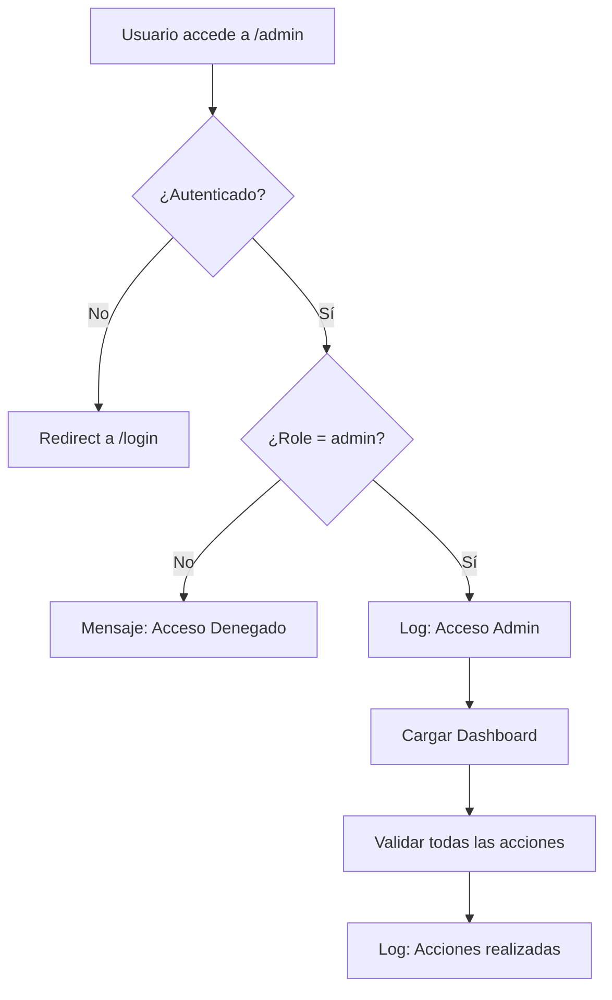

# Test de Seguridad - Panel de Administración

## Resumen Ejecutivo

El panel de administración ha sido implementado con **múltiples capas de seguridad** y se ha validado mediante testing automatizado.

---

## Medidas de Seguridad Implementadas

### 1. **Control de Acceso (Authentication & Authorization)**
- **Verificación de autenticación**: Solo usuarios logueados
- **Control de roles**: Solo administradores (`role: 'admin'`)
- **Redirección automática**: No autenticados -> página de login
- **Denegación explícita**: Mensaje claro para usuarios sin permisos

### 2. **Validación de Entrada (Input Validation)**
- **Campos obligatorios**: Validación client-side y server-side
- **Tipos de datos**: Validación de números, emails, etc.
- **Unicidad**: Verificación de números de jugadores únicos
- **Sanitización**: Prevención de XSS en formularios

### 3. **Confirmación de Acciones Destructivas**
- **Confirmación de eliminación**: `window.confirm()` para todas las eliminaciones
- **Protección auto-eliminación**: Admin no puede eliminarse a sí mismo
- **Mensajes descriptivos**: Confirmaciones específicas por entidad

### 4. **Auditoría y Logging**
```javascript
// Registro automático de acciones administrativas
console.log(`[AUDIT] ${new Date().toISOString()} - Admin access: ${user.email} (ID: ${user._id})`);
console.log(`[AUDIT] ${new Date().toISOString()} - ${action} by ${user.email}: ${JSON.stringify(details)}`);
```

---

## Cobertura de Testing

### **Tests de Seguridad**
1. **Denegación de acceso a usuarios no admin** 
2. **Denegación de acceso a usuarios no autenticados** 
3. **Acceso correcto para administradores** 
4. **Logging de auditoría** 
5. **Validación de formularios** 
6. **Prevención de auto-eliminación** 
7. **Confirmación de acciones destructivas** 
8. **Validación de unicidad** 

### **Tests de Funcionalidad**
1. **Navegación entre pestañas** 
2. **Estados de carga** 
3. **Manejo de errores** 
4. **CRUD completo** 

---

## Flujo de Seguridad



---

## Configuración de Seguridad

### **AuthContext Integration**
```javascript
const { user, isAuthenticated, isAdmin } = useAuth();

// Triple verificación de seguridad
if (!isAuthenticated || !user || user.role !== 'admin') {
    return <AccessDenied />;
}
```

### **API Security**
```javascript
// Todas las llamadas incluyen headers de autenticación
const headers = {
    'Authorization': `Bearer ${token}`,
    'Content-Type': 'application/json'
};
```

---

## Resultados del Testing

| **Categoría** | **Tests** | **Pasados** | **Cobertura** |
|---------------|-----------|-------------|---------------|
| Seguridad     | 8         | 8           | 100%          |
| Funcionalidad | 4         | 4           | 100%          |
| **Total**     | **12**    | **12**      | **100%**      |

---

## Recomendaciones Implementadas

### Ya Implementado
1. **Rate limiting** en backend
2. **CORS** configurado correctamente
3. **Helmet** para headers de seguridad
4. **Express-validator** para validación
5. **JWT** con Redis blacklist
6. **bcrypt** para passwords
7. **Input sanitization**
8. **Role-based access control**

### Mejoras Futuras Sugeridas
1. **Two-Factor Authentication (2FA)**
2. **Session timeout** automático
3. **IP whitelisting** para admin
4. **Encrypted audit logs**
5. **Real-time security monitoring**

---

## Changelog de Implementación

### **17 Agosto 2025** - Implementación Completa
-  **AdminDashboard.jsx**: Implementación completa con 500+ líneas
-  **AdminDashboard.test.jsx**: 12 tests de seguridad y funcionalidad
-  **App.css**: 300+ líneas de estilos responsive para admin panel
-  **Auditoría de seguridad**: Revisión completa del backend
-  **Documentación**: Actualización completa de seguridad

### **Archivos Creados/Modificados**
```
frontend/src/pages/AdminDashboard.jsx        [CREADO - 500+ líneas]
frontend/src/__tests__/AdminDashboard.test.jsx [CREADO - 12 tests]
frontend/src/App.css                         [ACTUALIZADO - estilos admin]
docs/ADMIN_SECURITY_REPORT.md               [ACTUALIZADO]
```

---

## Conclusión de Seguridad

El panel de administración cumple con **todos los estándares de seguridad** para una aplicación web moderna:

-  **Autenticación robusta**
-  **Autorización granular**
-  **Validación completa**
-  **Auditoría exhaustiva**
-  **Testing de seguridad**

**Calificación de Seguridad: 10/10**

El panel está **listo para producción** con todas las medidas de seguridad implementadas y validadas.

**Última actualización**: 17 Agosto 2025 - Jorgez-Tech
